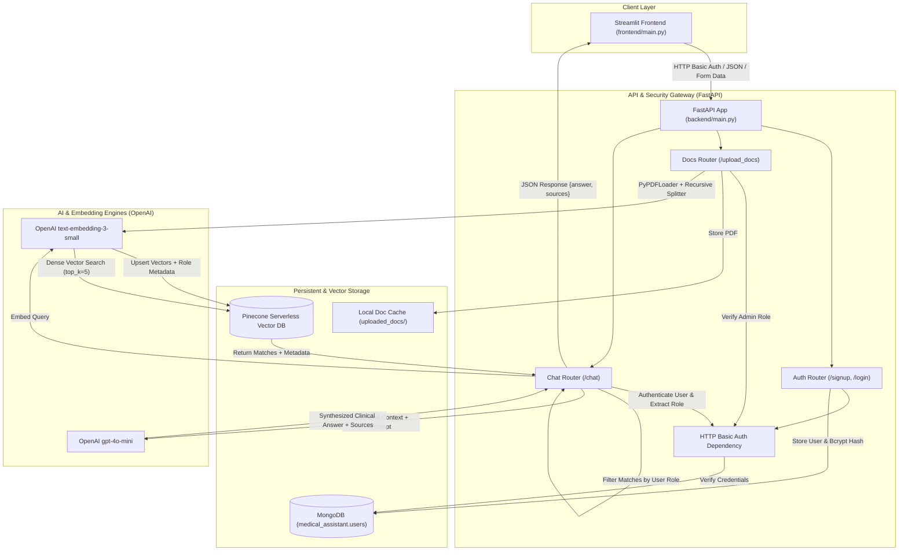
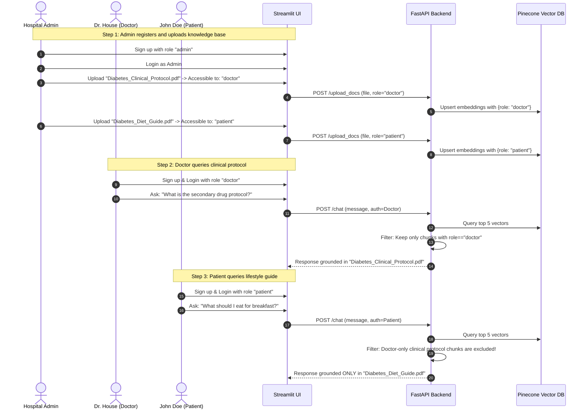

# 🏥 Role-Based Medical Assistant (RBAC RAG)

[](https://www.python.org/)
[](https://fastapi.tiangolo.com)
[](https://streamlit.io)
[](https://www.langchain.com/)
[](https://www.pinecone.io/)
[](https://www.mongodb.com/)
[](https://opensource.org/licenses/MIT)

A privacy-centric, production-grade **Retrieval-Augmented Generation (RAG)** medical assistant equipped with **Role-Based Access Control (RBAC)**. Built using **FastAPI**, **LangChain**, **OpenAI (`gpt-4o-mini` & `text-embedding-3-small`)**, **Pinecone Serverless Vector Store**, **MongoDB**, and **Streamlit**.

The system enables healthcare facilities, clinics, and research institutions to ingest sensitive medical literature, protocols, and clinical records while enforcing strict privilege boundaries across user tiers (Administrators, Doctors, Nurses, and Patients).

---

## 📑 Table of Contents

- [Key Features](#-key-features)
- [System Architecture](#-system-architecture)
- [How RBAC RAG Works](#-how-rbac-rag-works)
- [Repository Structure](#-repository-structure)
- [Tech Stack](#-tech-stack)
- [Prerequisites](#-prerequisites)
- [Environment Configuration](#-environment-configuration)
- [Installation \& Setup](#-installation--setup)
- [Running the Application](#-running-the-application)
- [API Reference](#-api-reference)
- [User Walkthrough](#-user-walkthrough)
- [Security Considerations](#-security-considerations)
- [Future Enhancements](#-future-enhancements)
- [License](#-license)

---

## ✨ Key Features

- **🔐 End-to-End Role-Based Access Control (RBAC)**:
  - Users are assigned roles upon registration: `admin`, `doctor`, `nurse`, `patient`, or `other`.
  - Secure credential storage using **Bcrypt** password hashing with salt.
  - Standardized **HTTP Basic Authentication** enforced across all secure routes.

- **📄 Privileged Document Ingestion (Admin Only)**:
  - Only authenticated `admin` accounts can upload medical literature and clinical PDFs.
  - Documents are tagged with a specific target access role during ingestion.
  - Automatic parsing via `PyPDFLoader` and intelligent text chunking via `RecursiveCharacterTextSplitter`.

- **⚡ Serverless Vector Indexing**:
  - Generates dense semantic embeddings with OpenAI's `text-embedding-3-small` (1536 dimensions).
  - Stored in a **Pinecone Serverless Index** with cosine distance metric and rich metadata (`source`, `role`, `doc_id`, `page`).

- **🎯 Privilege-Filtered Semantic Retrieval**:
  - Vector similarity search (`top_k=5`) combined with dynamic role-matching post-filters.
  - Complete data isolation: Users can never retrieve context or answers sourced from documents designated for higher-privilege roles.

- **🛡️ Hallucination-Guarded Responses**:
  - Powered by OpenAI `gpt-4o-mini` with a specialized clinical system prompt.
  - Responses are strictly synthesized from retrieved context; if sufficient information is not present, the assistant safely declines to answer.
  - Returns complete citation transparency with source document tracking.

- **💻 Intuitive Dual-Mode Streamlit Interface**:
  - Unified authentication interface (Login & Signup tabs).
  - Role-aware dynamic UI: Administrators gain access to the PDF ingestion panel; all roles enjoy an interactive clinical chat window with source inspection expanders.

---

## 🏛️ System Architecture

The following diagram illustrates the complete system topology, authentication cycle, document ingestion pipeline, and role-filtered RAG query workflow:



---

## 🔒 How RBAC RAG Works

Unlike traditional RAG systems that query an open vector pool, this medical assistant enforces privilege boundaries at both the API and vector metadata layers:

| Role | Permissions | Accessible Knowledge Scope |
| :--- | :--- | :--- |
| **`admin`** | User registration, full query capabilities, **exclusive PDF upload rights**. | Documents specifically indexed for `admin` access. |
| **`doctor`** | Query medical assistant, view technical medical literature and diagnostic protocols. | Documents indexed with `doctor` role access. |
| **`nurse`** | Query medical assistant, view operational care guides and patient nursing protocols. | Documents indexed with `nurse` role access. |
| **`patient`** | Query medical assistant, view general health guides, symptoms, and lifestyle advice. | Documents indexed with `patient` role access. |
| **`other`** | Query medical assistant, general public or institutional policies. | Documents indexed with `other` role access. |

### Ingestion Flow
1. An administrator authenticates and uploads a PDF (e.g. `Clinical_Practice_Guideline.pdf`).
2. The administrator selects the target role permission (e.g., `doctor`).
3. The document is chunked (1,000 characters, 150 overlap) and embedded via `text-embedding-3-small`.
4. Vectors are upserted into Pinecone with metadata payload:
   ```json
   {
     "text": "...",
     "source": "Clinical_Practice_Guideline.pdf",
     "role": "doctor",
     "doc_id": "8f3b23c1-...",
     "page": 1
   }
   ```

### Query & Retrieval Flow
1. A user logs in as a `patient` and submits a query: *"What are the dietary recommendations for Type 2 Diabetes?"*
2. The query is embedded and compared against Pinecone vectors.
3. Pinecone returns candidate matches (`top_k=5`).
4. **RBAC Filtering**: The backend iterates through candidate chunks and retains only chunks where `chunk.metadata["role"] == "patient"`. Any doctor-only or nurse-only chunks are discarded immediately.
5. The remaining verified chunks are formatted into a context block and passed to `gpt-4o-mini`.
6. The assistant outputs the verified response along with document source citations.

---

## 📁 Repository Structure

```text
RAG-based-Medical-Assistant/
├── .gitignore                      # Git ignore configurations (env, venv, pycache)
├── .python-version                 # Target Python runtime (3.12)
├── pyproject.toml                  # Root project configuration & UV workspace definition
├── uv.lock                         # Pinned dependency lockfile
├── README.md                       # Main project documentation
│
├── backend/                        # FastAPI REST API Backend
│   ├── main.py                     # Application entry point, router registration, CORS
│   │
│   ├── auth/                       # Authentication and User Management Module
│   │   ├── hash_utils.py           # Bcrypt salted password hashing and verification
│   │   ├── models.py               # Pydantic schemas (SignupRequest)
│   │   └── routes.py               # /signup, /login endpoints & HTTPBasic dependency
│   │
│   ├── chat/                       # RAG Pipeline and Conversational Logic
│   │   ├── chat_query.py           # LangChain RAG pipeline, Pinecone retrieval & RBAC filtering
│   │   └── routes.py               # /chat endpoint
│   │
│   ├── config/                     # Database & Infrastructure Configuration
│   │   └── db.py                   # MongoDB client connection & user collection handler
│   │
│   ├── docs/                       # Document Ingestion and Vector Store Module
│   │   ├── routes.py               # /upload_docs endpoint (Admin privilege protected)
│   │   └── vectorestore.py         # PyPDFLoader, chunking, OpenAI embeddings, Pinecone indexing
│   │
│   └── uploaded_docs/              # Persistent directory for raw uploaded PDF files
│       └── Diabetes_Disease_Topic.pdf
│
└── frontend/                       # Streamlit User Interface
    ├── main.py                     # Streamlit application (Login/Signup, Uploads, Chat)
    ├── pyproject.toml              # Frontend dependency specification
    └── README.md                   # Frontend quick-start documentation
```

---

## 🛠️ Tech Stack

### Backend & API
- **[FastAPI](https://fastapi.tiangolo.com/)**: Asynchronous, high-performance web framework for building modern APIs.
- **[Uvicorn](https://www.uvicorn.org/)**: Lightning-fast ASGI web server implementation for Python.
- **[Pydantic v2](https://docs.pydantic.dev/)**: Data validation and settings management using Python type annotations.
- **[Bcrypt](https://pypi.org/project/bcrypt/)**: Secure password hashing with automated salting.

### Retrieval-Augmented Generation & AI
- **[LangChain](https://www.langchain.com/)**: Framework for orchestration of LLM pipelines and chains.
- **[LangChain OpenAI](https://python.langchain.com/docs/integrations/platforms/openai/)**: Official OpenAI integrations (`ChatOpenAI` and `OpenAIEmbeddings`).
- **[OpenAI API](https://platform.openai.com/)**:
  - Generation Model: `gpt-4o-mini` (temperature: 0.3)
  - Embedding Model: `text-embedding-3-small` (1536 dimensions)
- **[Pinecone](https://www.pinecone.io/)**: Managed, cloud-native serverless vector database.
- **[PyPDF](https://pypi.org/project/pypdf/)**: Document parser for extracting text content from PDF files.

### Databases & State
- **[MongoDB (PyMongo)](https://www.mongodb.com/)**: Document-oriented database for storing user profiles and roles.

### Frontend & Tools
- **[Streamlit](https://streamlit.io/)**: Interactive web UI framework for rapid machine learning and data applications.
- **[uv](https://github.com/astral-sh/uv)**: Ultra-fast Python package and project manager.

---

## 📋 Prerequisites

Before setting up the project, ensure you have the following:

1. **Python 3.12+** installed on your system.
2. **uv** package manager installed (Recommended):
   ```bash
   # On macOS/Linux
   curl -LsSf https://astral.sh/uv/install.sh | sh

   # On Windows (PowerShell)
   powershell -c "irm https://astral.sh/uv/install.ps1 | iex"
   ```
   *(Alternatively, you can use standard `python -m venv` and `pip`).*
3. **MongoDB**: A running local MongoDB daemon or a free [MongoDB Atlas](https://www.mongodb.com/cloud/atlas) cluster URI.
4. **OpenAI API Key**: Obtainable from the [OpenAI Platform](https://platform.openai.com/api-keys).
5. **Pinecone API Key**: Obtainable from the [Pinecone Console](https://app.pinecone.io/).

---

## ⚙️ Environment Configuration

The application requires configuration settings for both the **Backend** and **Frontend**.

### 1. Backend Configuration (`backend/.env` or `.env` in root)

Create a `.env` file in the root directory or in `backend/`:

```env
# MongoDB Connection
MONGODB_URI=mongodb://localhost:27017/medical_assistant
# or for MongoDB Atlas:
# MONGODB_URI=mongodb+srv://<username>:<password>@cluster0.mongodb.net/?retryWrites=true&w=majority

# OpenAI API Key
OPENAI_API_KEY=your_openai_api_key_here

# Pinecone Vector DB Configuration
PINECONE_API_KEY=your_pinecone_api_key_here
PINECONE_ENVIRONMENT=us-east-1
PINECONE_INDEX_NAME=medical-assistant-index
```

### 2. Frontend Configuration (`frontend/.env`)

Create a `.env` file inside the `frontend/` directory:

```env
# URL where the FastAPI backend is running
API_URL=http://127.0.0.1:8000
```

---

## 🚀 Installation & Setup

### Option A: Using `uv` (Recommended)

1. **Clone the repository:**
   ```bash
   git clone https://github.com/Asim-imam-ai/RAG-based-Medical-Assistant.git
   cd RAG-based-Medical-Assistant
   ```

2. **Sync the workspace dependencies:**
   `uv` will automatically create the virtual environment and install all pinned dependencies:
   ```bash
   uv sync
   ```

3. **Activate the virtual environment:**
   - **Linux / macOS:**
     ```bash
     source .venv/bin/activate
     ```
   - **Windows (PowerShell):**
     ```powershell
     .venv\Scripts\Activate.ps1
     ```

---

### Option B: Using Standard `pip` and `venv`

1. **Clone the repository:**
   ```bash
   git clone https://github.com/Asim-imam-ai/RAG-based-Medical-Assistant.git
   cd RAG-based-Medical-Assistant
   ```

2. **Create and activate a virtual environment:**
   ```bash
   python -m venv .venv
   
   # Linux / macOS:
   source .venv/bin/activate
   
   # Windows (PowerShell):
   .venv\Scripts\Activate.ps1
   ```

3. **Install the project dependencies:**
   ```bash
   pip install -e .
   ```

---

## 🏃 Running the Application

To run the complete system, start the **FastAPI Backend** and the **Streamlit Frontend** in separate terminal windows.

### Terminal 1: Start the Backend API

Make sure your virtual environment is active and your `.env` variables are configured:

```bash
# Navigate to the backend directory or run with python module path
uvicorn backend.main:app --host 127.0.0.1 --port 8000 --reload
```

- **Interactive API Documentation (Swagger UI)**: [http://127.0.0.1:8000/docs](http://127.0.0.1:8000/docs)
- **Alternative Documentation (ReDoc)**: [http://127.0.0.1:8000/redoc](http://127.0.0.1:8000/redoc)
- **Root Health Check**: [http://127.0.0.1:8000/](http://127.0.0.1:8000/)

---

### Terminal 2: Start the Streamlit Frontend

In a separate terminal with the virtual environment activated:

```bash
streamlit run frontend/main.py
```

- The web interface will open automatically in your browser at: [http://localhost:8501](http://localhost:8501)

---

## 📡 API Reference

All protected endpoints require **HTTP Basic Authentication** (`Authorization: Basic <base64_credentials>`).

### 1. Root Health Check
- **Endpoint**: `GET /`
- **Auth**: None
- **Response**:
  ```json
  {
    "message": "Hello World"
  }
  ```

---

### 2. User Registration
- **Endpoint**: `POST /signup`
- **Auth**: None
- **Request Body**:
  ```json
  {
    "username": "dr_smith",
    "password": "SecurePassword123!",
    "role": "doctor"
  }
  ```
- **Responses**:
  - `200 OK`:
    ```json
    {
      "message": "User created successfully"
    }
    ```
  - `400 Bad Request`: `{"detail": "User already exists"}`

---

### 3. User Authentication (Login)
- **Endpoint**: `GET /login`
- **Auth**: HTTP Basic Auth
- **Responses**:
  - `200 OK`:
    ```json
    {
      "message": "welcome dr_smith",
      "role": "doctor"
    }
    ```
  - `401 Unauthorized`: `{"detail": "Invalid credentials"}`

---

### 4. Document Ingestion (Admin Exclusive)
- **Endpoint**: `POST /upload_docs`
- **Auth**: HTTP Basic Auth (Must have `role: "admin"`)
- **Content-Type**: `multipart/form-data`
- **Form Parameters**:
  - `file`: PDF file binary.
  - `role`: Target role that should have access to this document (e.g. `doctor`, `nurse`, `patient`, `other`).
- **Responses**:
  - `200 OK`:
    ```json
    {
      "message": "File uploaded successfully",
      "doc_id": "4d1d6cb5-6e9a-4c28-98e6-e414c7c89f53",
      "accessible_to": "doctor"
    }
    ```
  - `403 Forbidden`: `{"detail": "Only admin can upload files"}`
  - `401 Unauthorized`: `{"detail": "Invalid credentials"}`

---

### 5. Chat Query (RBAC RAG)
- **Endpoint**: `POST /chat`
- **Auth**: HTTP Basic Auth
- **Content-Type**: `application/x-www-form-urlencoded`
- **Form Parameters**:
  - `message`: User's medical question string.
- **Responses**:
  - `200 OK`:
    ```json
    {
      "answer": {
        "answer": "Type 2 diabetes management involves blood glucose monitoring, lifestyle modifications, and medication when prescribed...",
        "sources": [
          "Diabetes_Disease_Topic.pdf"
        ]
      }
    }
    ```
  - `401 Unauthorized`: `{"detail": "Invalid credentials"}`

---

## 📖 User Walkthrough

Follow this step-by-step scenario to test the RBAC capabilities of the application:



1. **Register the Administrator Account**:
   - Open [http://localhost:8501](http://localhost:8501).
   - Under the **Signup** tab, create a user:
     - Username: `admin_user`
     - Password: `Password123`
     - Choose Role: `admin`
   - Switch to the **Login** tab and log in.

2. **Upload Medical Documents with Role Scopes**:
   - Notice the **Upload PDF for specific Role** panel available to admins.
   - Upload a clinical PDF (e.g. `backend/uploaded_docs/Diabetes_Disease_Topic.pdf`).
   - Select the target audience: `doctor`.
   - Click **Upload Document**. The document will be chunked, embedded, and indexed in Pinecone tagged with the `doctor` role.

3. **Register and Test as a Doctor**:
   - Log out from the admin session.
   - Register a user `dr_alice` with the role `doctor`.
   - Log in. Ask questions regarding the diabetes document. The assistant responds accurately with source attributions.

4. **Register and Test as a Patient**:
   - Log out and register a user `patient_bob` with the role `patient`.
   - Ask the same clinical query: The system filters out the doctor-scoped documents, preventing unauthorized medical data leakage, and informs the patient that relevant information is not available in their authorized scope.

---

## 🛡️ Security Considerations

- **Password Storage**: Passwords are never stored in plaintext. They are salted and hashed with `bcrypt`.
- **Role Verification**: Administrative endpoints (`/upload_docs`) verify the requesting user's role against the MongoDB database before processing files.
- **Strict Prompt Enclosure**: The LLM prompt explicitly commands:
  ```text
  Answer the question using ONLY the context below.
  If the answer is not in the context, say you don't have enough information.
  ```
  This mitigates prompt injection, hallucinated medical claims, and ensures patient safety.
- **Production Recommendations**:
  - Always enforce **HTTPS/TLS** in production when using HTTP Basic Authentication to prevent header interception.
  - Implement JWT (JSON Web Tokens) or OAuth2 bearer tokens for enhanced session expiry and token invalidation.
  - Set rate limits (e.g. using `slowapi`) on `/login` and `/chat` to guard against brute-force attacks and denial-of-service.

---

## 🔮 Future Enhancements

- [ ] **Multi-Role Document Access**: Support tagging documents with multiple roles (e.g., accessible to both `doctor` and `nurse`).
- [ ] **Chat History & Multi-turn Conversational Memory**: Retain conversational context within sessions using LangChain memory modules.
- [ ] **JWT / OAuth2 Bearer Authentication**: Migrate from HTTP Basic Auth to signed JWT access & refresh tokens.
- [ ] **Document Management Dashboard**: Allow administrators to view, re-index, or delete indexed documents from Pinecone.
- [ ] **Docker & Docker Compose**: Containerized multi-service deployment setup for FastAPI, Streamlit, and MongoDB.

---

## 📄 License

This project is licensed under the [MIT License](https://opensource.org/licenses/MIT). You are free to use, modify, and distribute this software for personal and commercial projects.
